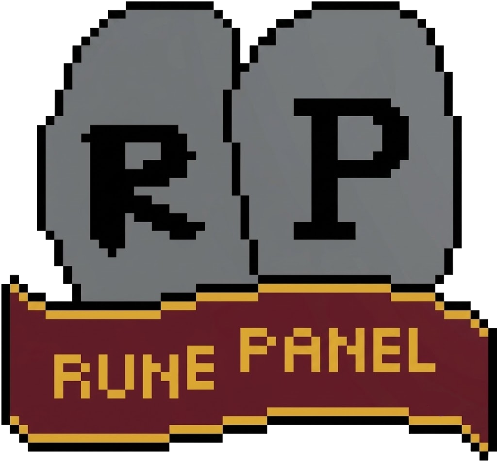
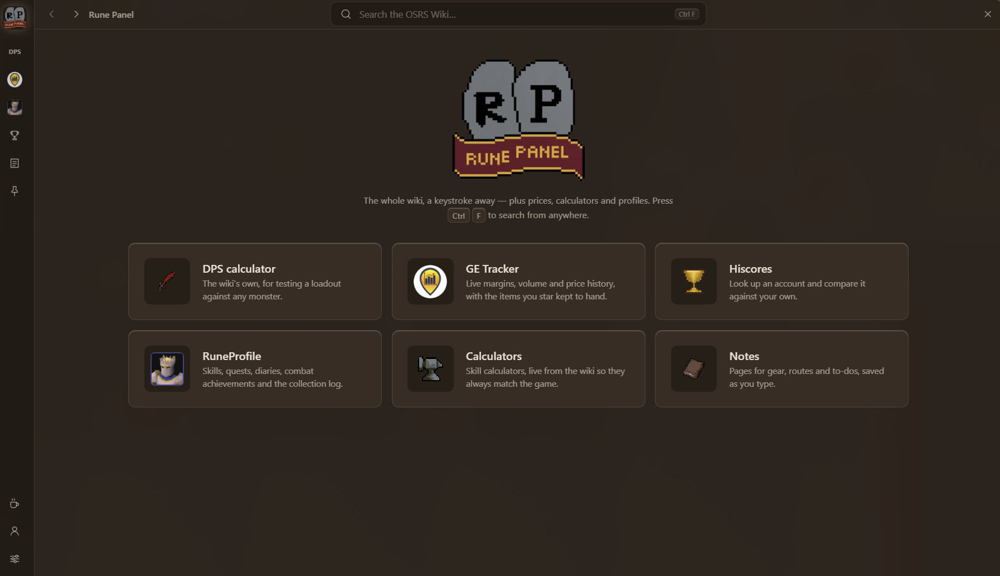
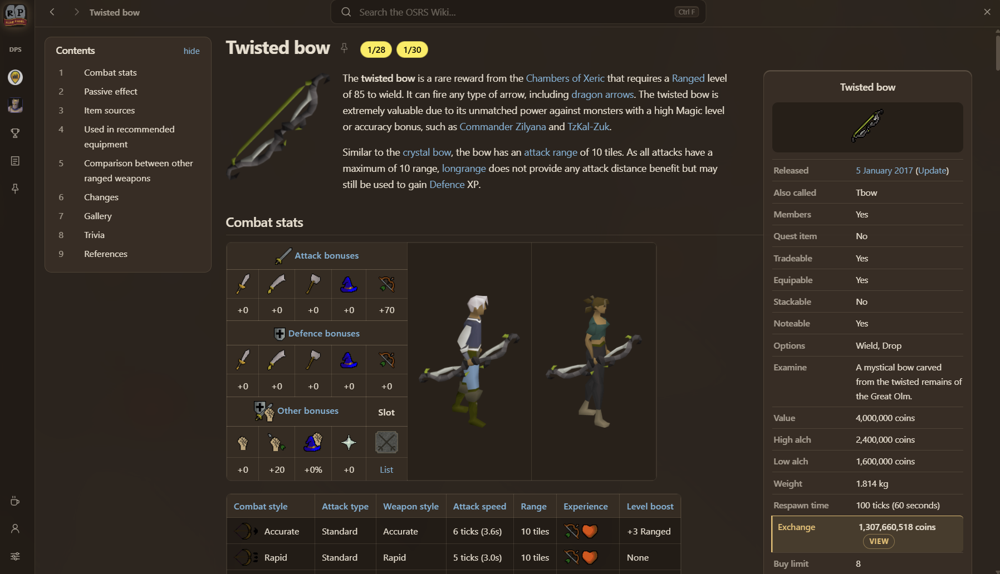
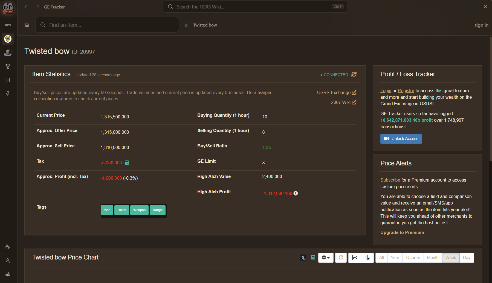
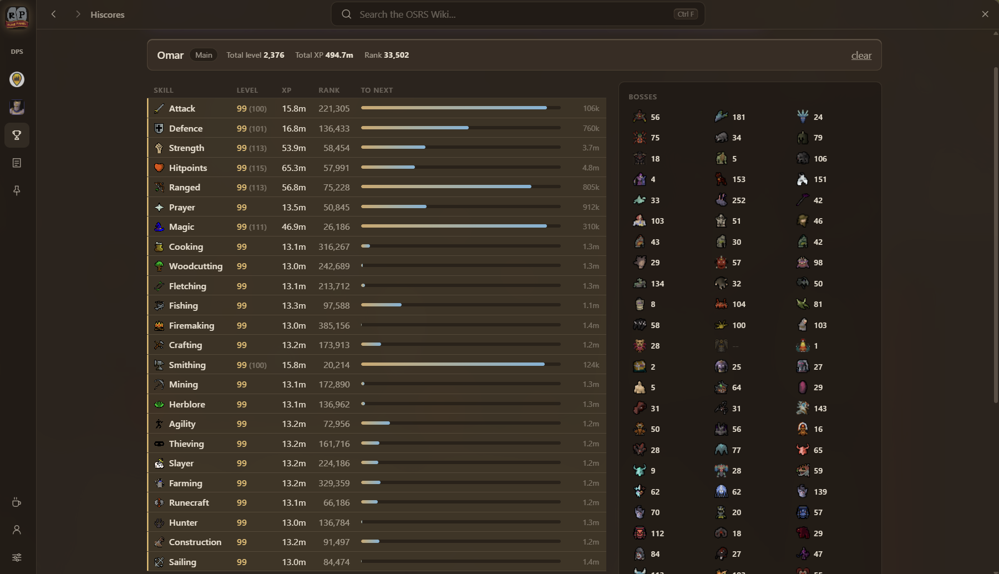
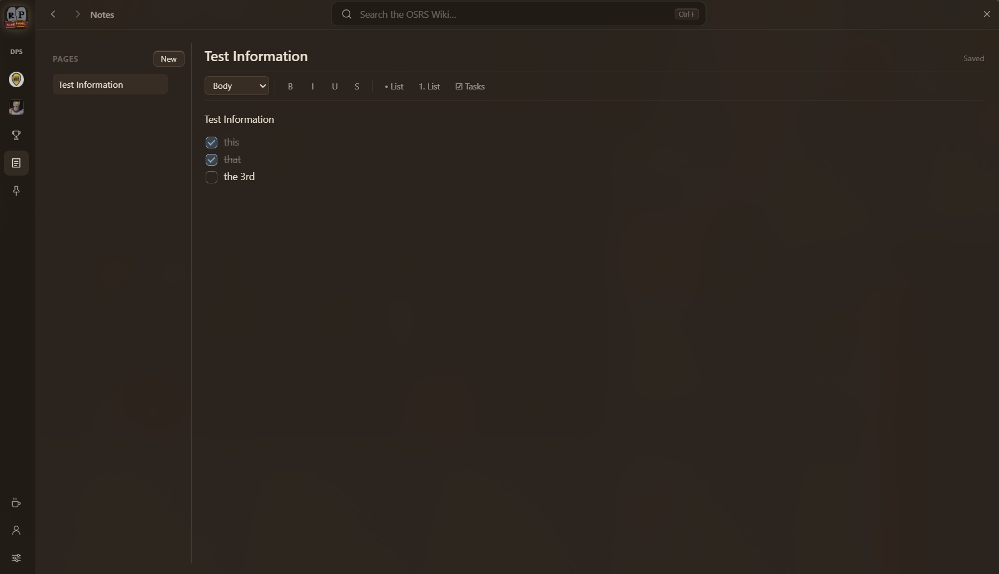

<p align="center">
  
</p>

<h1 align="center">Rune Panel</h1>

<p align="center">
  An all-in-one Old School RuneScape companion for Windows.<br>
  Press a hotkey and everything is there — over your game, over your browser, wherever you are.
</p>



---

## Install

Download the installer from [Releases](https://github.com/tristan7303/rune-panel/releases) and run it.

Windows shows **"Windows protected your PC"** the first time, because the installer is not code-signed. Click **More info** → **Run anyway**. You will only see it once — updates after that are handled in-app.

On first launch it downloads the wiki's page list. That takes about four minutes, and nothing works properly until it finishes.

## Shortcuts

| | |
|---|---|
| **Ctrl+Shift+Space** | Open or close, from anywhere |
| **Ctrl+F** | Search the wiki |
| **Ctrl+G** | Grand Exchange, ready to type |
| **Esc** | Back a step, then close |
| **Alt+←** / **Alt+→** | Back and forward |

Opening puts the caret in a search box, so you can start typing straight away. All shortcuts are configurable in settings.

It stays on top of the game — including a borderless-fullscreen client — and does not close when you click away. Both are settings if you want otherwise. The tray icon is the only way to quit.

## What's inside

### The wiki

Every article, restyled for the panel. Pages you have read are cached on your own machine and open instantly — combat stats, drop tables, quest guides, the lot.



### GE Tracker

Live margins, volume and price history, with the items you star kept to hand.



### Hiscores

Look up any account — every skill, every boss — and compare it against your own.



### Notes

Pages for gear, routes and to-dos, saved as you type.



There is more on the rail: the wiki's own DPS calculator, skill calculators that always match the game, and RuneProfile for quests, diaries, combat achievements and the collection log.

## Updates

Rune Panel checks for a new version shortly after launch and once a day after that. A strip appears at the top of the window when one exists — nothing downloads or installs until you click it, and it never restarts itself while you are using it.

## Your data

Everything lives in `%APPDATA%\rune-panel` — the page cache, the images and your settings. No account, no telemetry. Deleting that folder resets the app.

---

<details>
<summary><b>Building from source</b></summary>

Needs [Node.js](https://nodejs.org) 20 or newer.

```sh
npm install
npm run build
npx electron out/main/index.js     # run it
npm run dist                       # or build an installer into release/
```

Checks: `npm run typecheck`, and `SMOKE=1 npx electron out/main/index.js` — the second asserts real behaviour through the app's own IPC bridge.

**Cutting a release:**

```sh
npm version 0.2.6 -m "Release %s"
git push --follow-tags
```

CI builds on Windows and uploads to a **draft** GitHub Release. Review it, then publish — that is what ships it to everyone's updater.

Auto-update needs the repository to stay **public**. `electron-updater` checks releases unauthenticated; against a private repo GitHub answers 404 and every install silently reports "no updates" forever.

Signing is wired but unset. Supply `CSC_LINK` and `CSC_KEY_PASSWORD` as environment variables, or repository secrets for CI, and builds sign with no code change.

</details>

## Data and licence

| | |
|---|---|
| Articles, images, calculators | [OSRS Wiki](https://oldschool.runescape.wiki) |
| Item data and prices | [prices.runescape.wiki](https://prices.runescape.wiki) |
| DPS calculator | [tools.runescape.wiki/osrs-dps](https://tools.runescape.wiki/osrs-dps/) |
| Hiscores | Jagex |
| Profiles | [RuneProfile](https://www.runeprofile.com) |

Wiki content is licensed [CC BY-NC-SA 3.0](https://creativecommons.org/licenses/by-nc-sa/3.0/), credited and linked on every article page. That licence is **non-commercial** — Rune Panel is free and personal.

Rune Panel is not affiliated with Jagex or the OSRS Wiki. Old School RuneScape is a trademark of Jagex Ltd.
