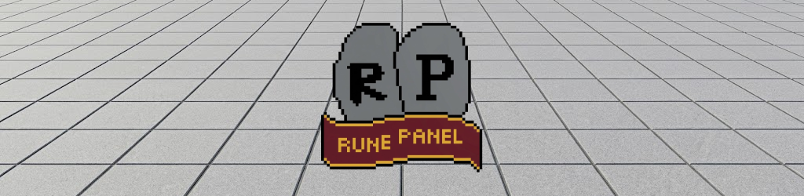

# Rune Panel

An all-in-one Old School RuneScape companion for Windows. Press a hotkey and the
whole wiki is there — over your game, over your browser, wherever you are — plus
the DPS calculator, skill calculators and RuneProfile.

It is built to be **fast** and to **stay out of the way**. Pages you have read
open instantly from your own machine. The window is either open or closed; there
is no widget sitting on your desktop waiting for you.

---

## What it does

**Search the whole wiki.** Every article and every alias the wiki knows — about
36,000 pages and 200,000 nicknames — searchable from your own machine in about
ten milliseconds. Type `bowfa` and you get *Bow of faerdhinen*. Type `tbow` and
you get *Twisted bow*. Misspell it entirely — `dragn scim` — and you still get
*Dragon scimitar*.

**Read articles without the website.** Pages render in Rune Panel's own layout:
dark, quiet, and with the item box redrawn as a proper panel instead of a wiki
table. Links work the way you expect, and hovering one for a moment loads it in
the background so the click is instant.

**The DPS calculator** — the wiki's own, embedded and stripped of its site
chrome.

**Skill calculators** — Smithing, Herblore, Crafting and the rest — live from
the wiki, so they always match the current game.

**RuneProfile** for skills, quests, diaries, combat achievements and the full
collection log. Type a username; Rune Panel remembers the ones you look up.

**Grand Exchange prices** — live buy and sell, margin, the margin *after* the
2% sell tax, buy limits, and a year of price history with volume. Search by item
name, the same way you search the wiki.

Hiscores are next.

---

## Getting it running

You need [Node.js](https://nodejs.org) 20 or newer.

```sh
npm install
npm run build
npx electron out/main/index.js
```

**Ctrl+Shift+Space** opens and closes it. So does the tray icon, which is also
the only way to quit.

The first launch spends about four minutes in the background learning every page
name on the wiki. Search works while it fills.

---

## Using it

| | |
|---|---|
| **Ctrl+Shift+Space** | Open or close, from anywhere |
| **Ctrl+K** | Jump back to search |
| **Esc** | Go back a step, then close |
| **Alt+←** / **Alt+→** | Back and forward |
| Mouse buttons 4 / 5 | Back and forward |

The rail down the left switches between search, the DPS calculator, prices,
hiscores, RuneProfile and the calculators. The gear at the bottom holds
settings.

### Worth knowing

**It stays on top of the game**, including a borderless-fullscreen client. It
does *not* close when you click away — you will often want to read it while
playing — though there is a setting if you would rather it did.

**It shows up in OBS and Discord.** Unlike a lot of overlays, this is an
ordinary window, so streaming and screen sharing capture it normally.

**Put your email in settings.** It goes into the requests Rune Panel makes to
the wiki so they know who is asking. The wiki does not charge for access and
does not rate limit; being identifiable is simply how you stay a good guest.

---

## Settings

**Hotkey** — anything you like, in Electron accelerator form
(`Control+Shift+Space`, `Alt+R`). If another program already owns the
combination, Rune Panel silently gets nothing, so pick another.

**Close when it loses focus** — off by default.

**Appearance** — three surfaces, picked from the button above settings: **dark**
for over a game client, **parchment** (warm tan, easiest for long reads), and
plain **light**.

**Acrylic backdrop** — the frosted blur behind the window. Windows 11 only, and
purely cosmetic; everything is designed to look right without it.

**Contact address** — see above.

**Wiki title index** — how many pages Rune Panel knows about, plus a rebuild
button. Rebuilding takes about four minutes.

**Article cache** — how many pages are stored, and how many the wiki has edited
since. Rune Panel tops this up in the background whenever the window is closed,
and pauses the moment you open it so it never competes with what you are
reading.

---

## Where the data comes from

| | |
|---|---|
| Articles, images, calculators | [OSRS Wiki](https://oldschool.runescape.wiki) |
| Item data and prices | [prices.runescape.wiki](https://prices.runescape.wiki) |
| DPS calculator | [tools.runescape.wiki/osrs-dps](https://tools.runescape.wiki/osrs-dps/) |
| Hiscores | Jagex |
| Profiles | [RuneProfile](https://www.runeprofile.com) |

Wiki content is licensed
[CC BY-NC-SA 3.0](https://creativecommons.org/licenses/by-nc-sa/3.0/), which
every article page credits and links back to. That licence is
**non-commercial**: Rune Panel is free and personal, and selling it would not be
allowed.

Rune Panel is not affiliated with Jagex or the OSRS Wiki. Old School RuneScape
is a trademark of Jagex Ltd.

---

## Where it keeps things

Everything lives in `%APPDATA%\Roaming\rune-panel` — the page cache, the search
index, the images and your settings. There is no account and no telemetry.
Deleting that folder resets the app completely.

The cache grows with what you read. Wiki articles are large — a big one runs to
a few hundred kilobytes — so expect a few hundred megabytes if you read a lot.
The **Article cache** setting shows where it stands.

---

## Building on it

Forks and contributions welcome. [CONTRIBUTING.md](CONTRIBUTING.md) covers how
the code is laid out, why it is arranged that way, and how to run the checks.
